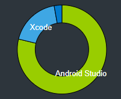
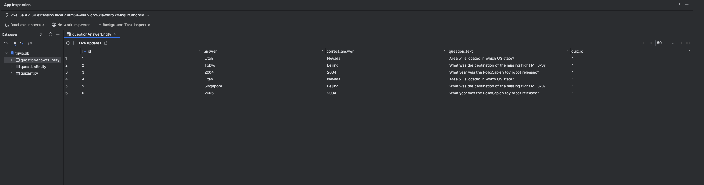

# KMM Quiz
KMM Quiz is an application for Creating quizzes written using Kotlin Multiplatform Mobile framework. It's allowing user to fetch questions from remote API, save them locally on his phone and then use to create and play quizzes.

|||
|---|---|

## About
KMM Quiz is an application written in Kotlin Multiplatform Mobile framework, which allow to write business logic once in Kotlin, and share it between iOS and Android native platform implementations. This allows for sharing code whose implementation looks almost identical on both platforms, implementing only the UI of the iOS version.
This project was created mainly to try out the KMM library, by implementing the most frequently used functionalities during creating mobile applications: communication with REST API and persistence using key-value and SQL Database storages.
Every part of the domain and data layer logic is shared between platforms up to [common ViewModel](shared/src/commonMain/kotlin/com/klewerro/kmmquiz/presentation/CommonViewModel.kt). From this moment, each platform have it's own platform-viewModel ([Android VM contract](androidApp/src/main/java/com/klewerro/kmmquiz/android/core/CommonAndroidViewModel.kt)) implementation. This decision was made mainly with Android in mind, because this approach allows you to use the Android viewModel, and thanks to this we can inject dependencies, use StateHandle, and other things that we are used to do as Android developers.

Application is written in the MVVM and MVI architecture - the view state is stored in the viewModel in StateFlow, while the view communicates with the ViewModel via events. This makes communication in the Jetpack compose and swiftUI frameworks simple, because you only need to observe one data stream (StateFlow). Also messages from UI to ViewModel can be easily propagated between UI components (composables/swiftUI strcuts), because you only need to have one event callback instead of a per event callback.

During the implementation of the project, I spent approximately 3/4 of the time implementing the shared and 
Android UI code, and the remaining 1/4 on implementing the UI code of the iOS application.

    

### Features
- Fetching list of questions from [Trivia API](https://opentdb.com/api_config.php). Configurable parts of requests are number of fetched questions and question category. Both are saved between app sessions.
- Selecting downloaded questions and saving them to your local database
- Selecting saved questions and creating a quiz from them
- Opening saved quiz and answering to its questions. Saving answers in local database (unfortunatelly currently only on Android).

## Libraries used
- Koltin - shared and Android modules programming language
- Swift - iOS platform module programming language 
- Jetpack Compose - Android UI framework
- SwiftUI - iOS UI framework
- Moko resources - storing string and color resources in shared module and make it usable on both Android and iOS platforms
- Dagger Hilt - Dependency Injection libary used in Android project module
- Ktor - pure kotlin library used to HTTP communication
- Sgl Delight - Android-context independent SQL database library
- Multiplatform settings - KeyValue storage, to store small amount of primitive-type data. Equivalent of Android DataStore/SharedPreferences or iOS UserDefaults, but cross-platform.

[Link to libs.versions toml file](gradle/libs.versions.toml)

## Screenshots
**Android**
|||||
|---|---|---|---|
|||||
||||  |

**iOS**
| ||||
|---|---|---|---|
|||||
| ||  |  |

Inserted quiz database table:

## How to run application
In the case of the Android version, you can simply build the project and run the application on an emulator or physical phone. I also created a release containing a ready-made .apk file. In terms of IDE setting, you will only need to install KMM plugin.

When it comes to the iOS project, it is necessary to have a Mac with xCode installed and the appropriate KMM configuration. I can't give you a simple list of things to do to achieve this. Generally, it is best to start by installing ***homebrew*** and then installing the ***kdoctor*** package through it. This library should tell you what's missing on your system.

## Todo
- [ ] Implement play quiz view on iOS
- [ ] Finish play quiz functionality on both platforms
- [ ] Loading app state after process death
- [ ] Write Unit Tests
- [ ] Play quizzes via Bluetooth